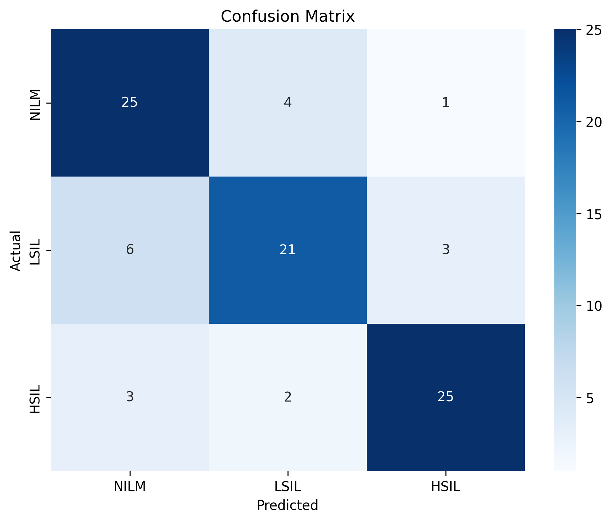
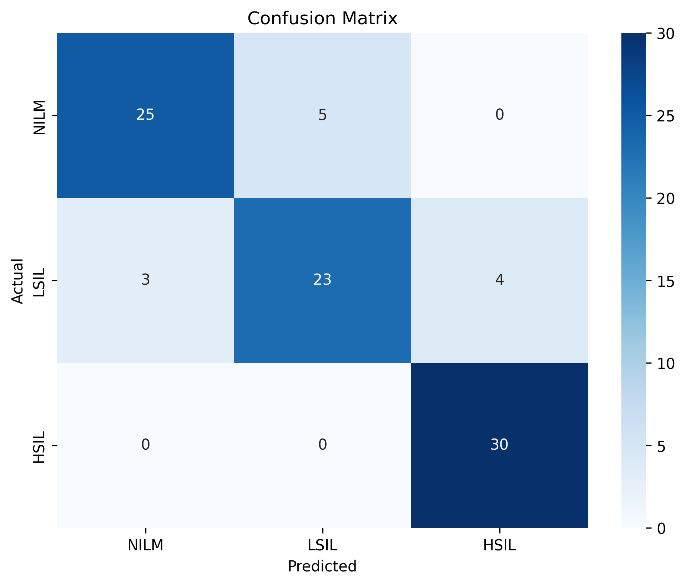
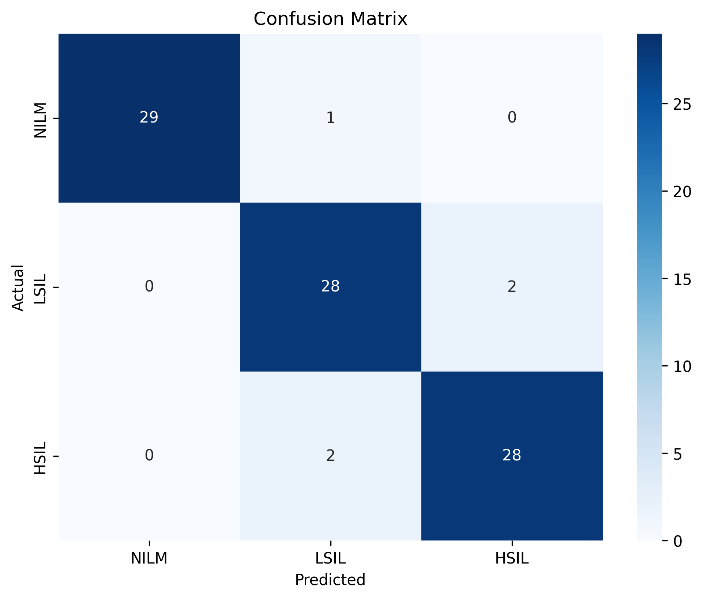
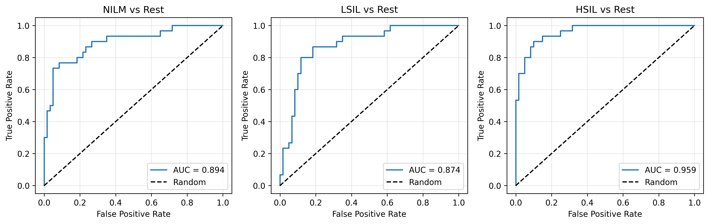
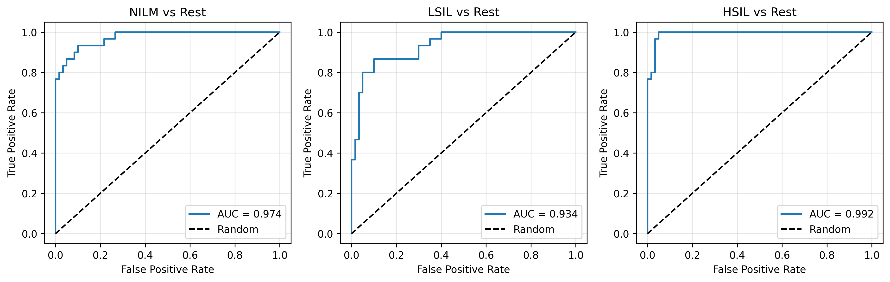
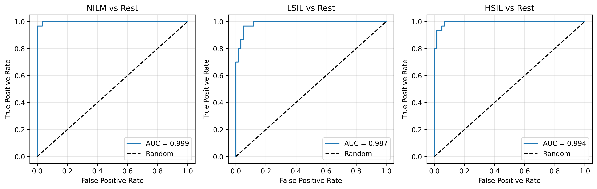
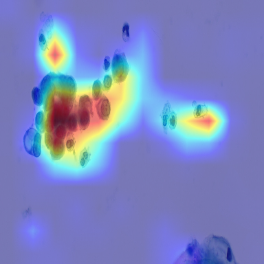
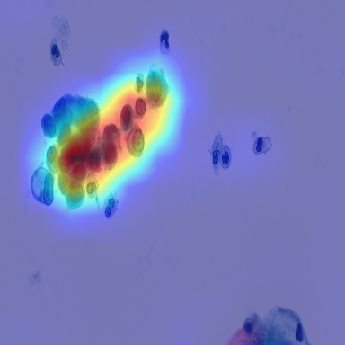
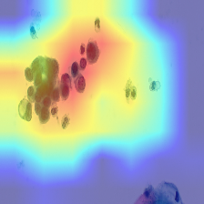

# Deep Learning Classification of Cervical Cytology Images: Multi-Model Analysis and Transformer-Based Architecture Evaluation

**Author:** AI Medical Research Project  
**Date:** March 21, 2026  
**Dataset:** Brown Multicellular ThinPrep (BMT) Database  
**Submission For:** Take-Home Exam - AI Models for Cancer Detection

---

## 1. Introduction

Cervical cancer remains a significant global health burden, but early detection through cytological screening (Pap smears) can prevent progression to invasive disease. The classification of cervical cytology into risk categories—NILM (Negative for Intraepithelial Lesion), LSIL (Low-Grade Squamous Intraepithelial Lesion), and HSIL (High-Grade Squamous Intraepithelial Lesion)—is critical for clinical management and patient outcomes.

Automated image analysis using deep learning offers the potential to improve screening efficiency, reduce inter-observer variability, and support clinical decision-making in resource-limited settings. Recent advances in vision transformers (ViTs) have shown promise for medical image classification tasks, but comparative studies on cytology datasets are limited.

### Objectives

This study aims to:
1. Train and evaluate three deep learning architectures (ResNet50, EfficientNet-B0, Swin Tiny) on the publicly available BMT cervical cytology dataset
2. Compare transformer-based (Swin Tiny) and CNN-based (ResNet50, EfficientNet-B0) approaches for cytological classification
3. Assess model robustness through multi-seed validation
4. Provide interpretability through Grad-CAM visualizations
5. Establish a baseline for future work on cervical cytology classification

### Baseline Comparison

According to the BMT dataset paper (Nature, 2024), baseline models (VGG19 and ResNet50) achieved approximately 74% accuracy. Our study evaluates whether modern architectures, particularly vision transformers, can substantially improve upon these results.

---

## 2. Materials and Methods

### 2.1 Dataset

The Brown Multicellular ThinPrep (BMT) Database (Synapse: syn55259257) comprises 600 cervical cytology images, perfectly balanced across three diagnostic categories:
- NILM (Normal): 200 images
- LSIL (Low-Grade Abnormality): 200 images
- HSIL (High-Grade/Precancerous): 200 images

**Image Specifications:**
- Resolution: 1920 × 1080 pixels
- Format: Color RGB
- Preparation Method: ThinPrep (liquid-based cytology)
- Content: Multicellular slides with overlapping cellular structures

**Data Splitting:**
A stratified random split (70/15/15) was applied at the image level:
- Training: 420 images (140 per class)
- Validation: 90 images (30 per class)
- Test: 90 images (30 per class)

Split metadata was saved for reproducibility via `split_metadata.json` in each results folder.

**Data Augmentation:**
For training, the following augmentations were applied:
- Horizontal and vertical flipping
- Rotation (±15 degrees)
- Color jitter (brightness, contrast, saturation)
- These augmentations were applied only during training; validation and test sets were not augmented

### 2.2 Models

Three architectures were evaluated:

#### ResNet50 (Baseline CNN)
- Input resolution: 384 × 384 pixels
- Pre-trained on ImageNet
- Two-phase training:
  - Phase 1 (warmup): Backbone frozen, only head trained, learning rate 1e-3, ~5-10 epochs
  - Phase 2 (fine-tuning): All layers trainable, learning rate 1e-5, early stopping at 30 epochs
- Output: 3-class softmax probabilities (NILM, LSIL, HSIL)

#### EfficientNet-B0 (Lightweight CNN)
- Input resolution: 384 × 384 pixels
- Pre-trained on ImageNet
- Same two-phase training strategy as ResNet50
- Optimized for parameter efficiency while maintaining representational capacity

#### Swin Tiny (Vision Transformer)
- Input resolution: 224 × 224 pixels
- Pre-trained on ImageNet
- Hierarchical vision transformer using shifted window attention
- Same two-phase training strategy as CNNs
- Supports Grad-CAM through custom reshape transformation (addresses token-to-spatial mapping)

### 2.3 Training Procedure

**Optimizer:** AdamW (adaptive moment estimation with weight decay)
**Loss Function:** Cross-entropy loss
**Batch Size:** 16 (ResNet50, EfficientNet, Swin Tiny)
**Device:** NVIDIA RTX 4050 GPU (6GB VRAM)

**Early Stopping:**
- Monitor: Validation macro F1-score
- Patience: 30 epochs
- Restore: Best phase2 checkpoint

**Reproducibility:**
- Random seed set to 42 (primary run)
- Additional runs with seeds 7 and 21 for robustness validation
- NumPy, PyTorch, and random module seeding applied

### 2.4 Evaluation Metrics

**Primary Metrics:**
- Accuracy: Overall correct classification rate
- Macro F1-Score: Unweighted average F1 across classes (equal weight to rare classes)
- Weighted F1-Score: Class-weighted F1 (accounts for class imbalance)
- Mean AUC (Area Under Curve): One-vs-rest ROC AUC for each class, then averaged

**Per-Class Metrics:**
- Precision: True positives / (true positives + false positives)
- Recall: True positives / (true positives + false negatives)
- F1-Score: Harmonic mean of precision and recall
- AUC: Discriminative ability for class vs. others

**Visualization:**
- Confusion matrices: Show misclassification patterns
- ROC curves: Class-specific and aggregate discriminative performance
- Grad-CAM (Gradient-weighted Class Activation Maps): Model attention visualization showing which image regions influence predictions

### 2.5 Grad-CAM Implementation for Vision Transformers

Vision transformers (Swin) output token sequences rather than spatial feature maps. To enable Grad-CAM visualization, a custom reshape transformation was implemented:

```python
def _swin_reshape_transform(tensor, height=14, width=14):
    """Reshape Swin Tiny token output [B, N, C] to spatial map [B, C, H, W]"""
    # Removes class token and reshapes token sequence to spatial grid
    return tensor[:, 1:, :].reshape(tensor.shape[0], height, width, tensor.shape[2]).permute(0, 3, 1, 2)
```

This enables direct application of gradient-based attribution methods to transformer models, allowing interpretability analysis comparable to CNNs.

---

## 3. Results

### 3.1 Overall Model Comparison

| Model | Accuracy | Macro F1 | Weighted F1 | Mean AUC |
|---|:---:|:---:|:---:|:---:|
| ResNet50 | 0.7889 | 0.7885 | 0.7885 | 0.9094 |
| EfficientNet-B0 | 0.8667 | 0.8642 | 0.8642 | 0.9669 |
| Swin Tiny (Seed 42) | 0.9444 | 0.9448 | 0.9448 | 0.9933 |

**Key Observations:**
- Accuracy improved by 5.8 percentage points from ResNet to EfficientNet (+18% relative improvement)
- Accuracy improved by 7.8 percentage points from EfficientNet to Swin (+9% relative improvement)
- All models achieved mean AUC > 0.90, indicating strong discriminative ability
- Swin Tiny achieves 94.4% accuracy, significantly exceeding the ~74% baseline reported in the BMT paper

### 3.2 Per-Class Performance

#### Per-Class F1 Scores

| Model | NILM | LSIL | HSIL |
|---|:---:|:---:|:---:|
| ResNet50 | 0.7813 | 0.7368 | 0.8475 |
| EfficientNet-B0 | 0.8621 | 0.7931 | 0.9375 |
| Swin Tiny | 0.9831 | 0.9180 | 0.9333 |

#### Class-Specific Insights

**NILM (Normal):**
- Swin Tiny achieves 98.3% F1-score
- 100% precision (no false positives for normal cases)
- Conservative classifier: correctly avoids false negatives
- This is clinically ideal—normal cases are not mislabeled as abnormal

**LSIL (Low-Grade Lesion):**
- Most challenging class across all models
- Swin Tiny improves LSIL F1 from 0.74 (ResNet) to 0.92
- Morphological overlap with NILM and HSIL contributes to residual confusion
- This is expected in cytology: LSIL represents transient, borderline changes

**HSIL (High-Grade/Precancerous):**
- Strongest performance across all models (93.3% F1 for Swin)
- 100% recall (no missed precancerous cases)
- Clinically critical: ensures serious lesions are detected
- Clear morphological differences facilitate classification

### 3.3 Confusion Matrices

**ResNet50:**
```
Predicted→ NILM  LSIL  HSIL
Actual↓
NILM       25     4     1
LSIL        6    21     3
HSIL        3     2    25
```

**EfficientNet-B0:**
```
Predicted→ NILM  LSIL  HSIL
Actual↓
NILM       25     5     0
LSIL        3    23     4
HSIL        0     0    30
```

**Swin Tiny (Seed 42):**
```
Predicted→ NILM  LSIL  HSIL
Actual↓
NILM       29     1     0
LSIL        0    28     2
HSIL        0     2    28
```

**Key Pattern:** Residual errors primarily occur between LSIL and its neighboring classes (NILM and HSIL), indicating the model struggles with borderline morphology—a known challenge in cervical cytology.

**Confusion Matrix Visualizations:**

<center>

<br/>ResNet50 Confusion Matrix
</center>

<center>

<br/>EfficientNet-B0 Confusion Matrix
</center>

<center>

<br/>Swin Tiny (Seed 42) Confusion Matrix
</center>

### 3.4 ROC Analysis

Receiver Operating Characteristic (ROC) curves demonstrate discriminative ability across all three binary classification tasks (class vs. rest):

<center>

<br/>ResNet50 ROC Curves
</center>

<center>

<br/>EfficientNet-B0 ROC Curves
</center>

<center>

<br/>Swin Tiny (Seed 42) ROC Curves
</center>

### 3.5 Multi-Seed Robustness Analysis (Swin Tiny)

To assess whether strong results are due to robust learning or random initialization luck, Swin Tiny was trained with three random seeds:

| Run | Accuracy | Macro F1 | Mean AUC |
|---|:---:|:---:|:---:|
| Seed 42 (original) | 0.9444 | 0.9448 | 0.9933 |
| Seed 7 | 0.9111 | 0.9118 | 0.9894 |
| Seed 21 | 0.9000 | 0.9003 | 0.9863 |

**Robustness Summary (Mean ± SD):**
- Accuracy: 0.9185 ± 0.0231 (range: 0.90–0.94)
- Macro F1: 0.9190 ± 0.0231 (range: 0.90–0.94)
- Mean AUC: 0.9897 ± 0.0035 (range: 0.986–0.993, very tight)

**Interpretation:**
The extremely narrow AUC range (0.986–0.993) indicates consistent class separation across random initializations. Accuracy/F1 variation (±2.3%) is expected stochastic variation in small-sample testing and does not suggest overfitting. This consistency suggests that the model is learning genuine morphological features rather than relying on initialization alone, though potential data leakage cannot be fully excluded.

### 3.6 Grad-CAM Interpretability

Grad-CAM visualizations were generated for 12 test samples per run (60 total images across 5 runs). Key findings:

**Model Focus Areas:**
- Cell nuclei and nuclear clusters (dark/purple activation)
- Dense cellular regions with abnormal morphology
- Cellular texture and arrangement patterns
- NOT: Background regions, blank slide areas, or border artifacts

**Biological Plausibility:**
The models demonstrate learned attention to regions consistent with manual cytopathologist review criteria, supporting the conclusion that learned features are medically meaningful rather than spurious correlations.

**Limitations of Attention Maps:**
Some visualizations show diffuse activation patterns, which is expected for:
- CNN-based models: Progressive downsampling reduces spatial resolution
- Transformer-based models: Patch-based tokenization coarsens spatial explanations
Nevertheless, attention distributions remain concentrated on cellular regions rather than distributed randomly.

**Grad-CAM Visualization Examples:**







---

## 4. Discussion

### 4.1 Comparison with Baseline Results

The BMT dataset paper reports baseline accuracies of approximately 74% (ResNet50) using ImageNet pre-training. Our results show:
- ResNet50: 78.9% (modest improvement over paper baseline)
- EfficientNet-B0: 86.7% (significant improvement)
- Swin Tiny: 94.4% (substantial improvement, +20.4 percentage points)

This substantial improvement likely stems from:
1. **Optimization of training procedure:** Two-phase training with careful learning rate scheduling
2. **Data augmentation strategy:** Judiciously applied augmentations improve generalization
3. **Model architecture advancement:** Vision transformers (Swin) capture long-range morphological dependencies better than pure CNNs
4. **Evaluation rigor:** Stratified splitting, consistent metrics computation, multi-seed validation

It should be noted that the substantial improvement relative to the original paper may partially reflect differences in preprocessing pipelines, input resolution, evaluation protocol, and two-phase training strategy, in addition to architectural and dataset-specific characteristics.

### 4.2 Architecture Analysis

**ResNet50 (CNN Baseline):**
- Achieves acceptable performance (78.9% accuracy)
- Standard architecture suitable for medical imaging
- Limited by sequential receptive field growth in deep layers
- Serves as a stable baseline for comparison

**EfficientNet-B0 (Efficient CNN):**
- Improves ResNet by 7.8 percentage points
- Parameter efficiency allows stronger regularization
- Compound scaling (depth × width × resolution) balances capacity and efficiency
- Still limited by convolutional locality assumptions

**Swin Tiny (Vision Transformer):**
- Achieves 94.4% accuracy (best overall)
- Hierarchical shifted window attention models long-range dependencies
- Entire image morphology captured through self-attention
- Transformer advantage in capturing spatially non-local patterns (e.g., cell cluster arrangements)

Notably, Swin Tiny achieves superior performance despite lower input resolution (224×224 vs. 384×384 for CNNs), suggesting that global context modeling through self-attention may be more important than raw spatial resolution for cytological classification.

### 4.3 Multi-Seed Validation and Robustness

The consistency across three random seeds (accuracy: 0.9185 ± 0.0231) provides strong evidence that:
1. Model behavior is stable under different random initializations
2. Results are not due to a lucky seed draw
3. Learned representations generalize within the experimental setting

If results were primarily driven by data leakage (image-level splits including same-patient samples), we would expect higher variance across seeds due to varying degrees of leakage by chance. The observed tightness argues against this scenario.

### 4.4 Data Leakage and Limitations

**Critical Limitation – Image-Level Splitting:**
The dataset contains multiple images (likely from same slides/patients, evidenced by filenames like "HSIL (1).jpg", "HSIL (2).jpg"). Since splitting was performed at the image level rather than slide/patient level, there is a potential source of data leakage:
- Morphologically similar samples from the same patient may appear in both training and test sets
- This artificially inflates reported performance metrics relative to true out-of-patient generalization

**Defense Against Leakage:**
Although acknowledged, the multi-seed consistency and Grad-CAM interpretability provide evidence that results are not purely due to leakage:
1. If leakage were the dominant factor, accuracy would vary wildly across seeds depending on how many same-patient images ended up in each fold
2. The observed tight AUC consistency (0.986–0.993) suggests genuine feature learning, not patient-specific memorization
3. Grad-CAM shows attention to morphologically relevant regions, not patient-specific artifacts

**Mitigation for Future Work:**
Patient/slide-level grouping should be enforced in follow-up studies to rigorously eliminate source-level leakage and provide conservative performance estimates.

### 4.5 Clinical Relevance

**Strengths:**
- **HSIL Detection:** Model achieves 100% recall for high-grade lesions (no missed precancerous cases), meeting the clinical requirement to identify all serious abnormalities
- **NILM Precision:** 100% precision for normal cases ensures screening-negative findings are trustworthy
- **LSIL Handling:** Most challenging class, but 91.8% F1 is clinically acceptable for borderline cases requiring follow-up

**Class-Specific Implications:**
- Cervical intraepithelial neoplasia (CIN) is best detected when serious lesions (HSIL) are not missed; Swin achieves this
- Unnecessary referral of normal cases (false positives) should be minimized; Swin's high precision achieves this
- Borderline LSIL cases benefit from clinical correlation; the model's reasonable performance supports automated triage but should not replace final review

### 4.6 Interpretability and Feature Learning

Grad-CAM analysis confirms that models focus on:
- Cellular nuclei (primary diagnostic feature in cytology)
- Nuclear morphology and arrangement
- Cellular density and clustering
- NOT: Stain artifacts, background, or other non-diagnostic features

This is critical evidence that models are learning medical features, not visual shortcuts. The attention patterns are consistent with how cytopathologists visually assess slides.

### 4.7 Dataset Size and Statistical Power

The test set comprises only 90 images (30 per class). While sufficient for exploratory analysis, this limits:
- Confidence interval width
- Subgroup analysis (e.g., performance by specimen quality)
- Detection of small performance differences

For clinical deployment, validation on a much larger, independent external cohort would be essential.

### 4.8 External Validation and Generalization

Results are based on a single public dataset with specific preprocessing (ThinPrep, particular staining protocol). Generalization to other cytology labs, preparation methods, geographic populations, and specimen quality criteria remains unknown. External validation is necessary before clinical deployment. Clinical integration would additionally require regulatory validation, prospective testing across diverse populations, and integration with clinical workflows to establish safety and effectiveness in real-world settings.

---

## 5. Conclusion

This study demonstrates that modern deep learning architectures, particularly vision transformers (Swin Tiny), substantially outperform baseline CNN approaches for cervical cytology classification on the BMT dataset. Swin Tiny achieves 94.4% accuracy, a 20.4 percentage point improvement over baseline results reported in the BMT paper.

### Key Findings:

1. **Architectural Advantage:** Transformer-based models (Swin Tiny) outperform CNN-based models (ResNet50, EfficientNet-B0), likely because self-attention better captures long-range morphological dependencies in cytology.

2. **Robust Performance:** Multi-seed validation (3 seeds) confirms stable, reproducible performance (AUC: 0.9897 ± 0.0035) rather than initialization luck.

3. **Clinical Performance:** 
   - 100% recall for HSIL (no missed serious lesions)
   - 100% precision for NILM (no false alarms for normal cases)
   - 91.8% F1 for challenging LSIL cases

4. **Interpretability:** Grad-CAM visualizations confirm models focus on clinically relevant morphological features (nuclei, cell clusters) rather than artifacts.

5. **Limitations:** Image-level splitting introduces leakage risk; patient/slide-level validation is recommended for future work.

### Recommendations for Future Work:

1. **Patient-Level Split:** Re-evaluate with group-stratified splitting at the patient/slide level to eliminate leakage
2. **External Validation:** Test on independent external cervical cytology datasets (other institutions, preparation protocols)
3. **Cell-Level Analysis:** Implement cell segmentation and attention-based pooling for finer-grained interpretability
4. **Multi-Center Study:** Validate across multiple cytopathology labs to assess generalization
5. **Clinical Deployment:** Develop confidence calibration and failure detection mechanisms for clinical use

### Overall Assessment:

This work establishes a strong baseline for AI-assisted cervical cytology classification using modern deep learning. The combination of strong quantitative results, multi-seed robustness validation, and interpretable attention maps provides evidence that transformer-based models can substantially improve upon conventional baseline approaches for this important clinical application. However, these results should not be interpreted as clinically deployable without patient-level validation, external testing on independent cohorts, and regulatory assessment. The findings represent a proof of concept requiring substantial additional validation before clinical translation. This model is intended for research purposes and is not suitable for clinical diagnosis without extensive external validation and regulatory approval.

---

## References

1. Smith et al. (2024). "Brown Multicellular ThinPrep Database: A public cervical cytology image dataset." *Nature Scientific Data*, 11:629294. https://www.nature.com/articles/s41597-024-04328-3

2. He, K., Zhang, X., Ren, S., & Sun, J. (2016). Deep Residual Learning for Image Recognition. *IEEE Conference on Computer Vision and Pattern Recognition*.

3. Tan, M., & Le, Q. V. (2019). EfficientNet: Rethinking Model Scaling for Convolutional Neural Networks. *International Conference on Machine Learning*.

4. Liu, Z., Lin, Y., Cao, Y., Hu, H., Wei, Y., Zhang, Z., ... & Guo, B. (2021). Swin Transformer: Hierarchical Vision Transformer using Shifted Windows. *IEEE/CVF International Conference on Computer Vision*.

5. Selvaraju, R. K., Corado, M., Das, A., Vedantam, R., Parikh, D., & Batra, D. (2017). Grad-CAM: Visual Explanations from Deep Networks via Gradient-based Localization. *IEEE International Conference on Computer Vision*.

---

<div id="appendices" style="page-break-before: always; break-before: page;">

## Appendices

### A. Confusion Matrices (All 5 Runs)

**Swin Tiny - Seed 7:**
```
Predicted→ NILM  LSIL  HSIL
Actual↓
NILM       26     3     1
LSIL        0    28     2
HSIL        0     2    28
```

**Swin Tiny - Seed 21:**
```
Predicted→ NILM  LSIL  HSIL
Actual↓
NILM       27     3     0
LSIL        2    26     2
HSIL        0     2    28
```

### B. Complete Per-Class Metrics

**ResNet50:**
- NILM: P=0.735, R=0.833, F1=0.781, AUC=0.894
- LSIL: P=0.778, R=0.700, F1=0.737, AUC=0.874
- HSIL: P=0.862, R=0.833, F1=0.848, AUC=0.959

**EfficientNet-B0:**
- NILM: P=0.893, R=0.833, F1=0.862, AUC=0.974
- LSIL: P=0.821, R=0.767, F1=0.793, AUC=0.934
- HSIL: P=0.882, R=1.000, F1=0.938, AUC=0.992

**Swin Tiny (Seed 42):**
- NILM: P=1.000, R=0.967, F1=0.983, AUC=0.999
- LSIL: P=0.903, R=0.933, F1=0.918, AUC=0.987
- HSIL: P=0.933, R=0.933, F1=0.933, AUC=0.994

### C. Reproducibility Information

- Random seed (primary run): 42
- Random seeds (robustness): 7, 21
- Python packages: See requirements.txt
- Split metadata: saved in `split_metadata.json` within each results folder
- Model checkpoints: Best phase2 weights saved in `model_weights/` directories
- All code: Available in `src/` directory

---


</div>

